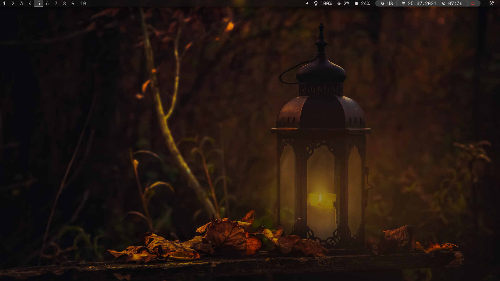
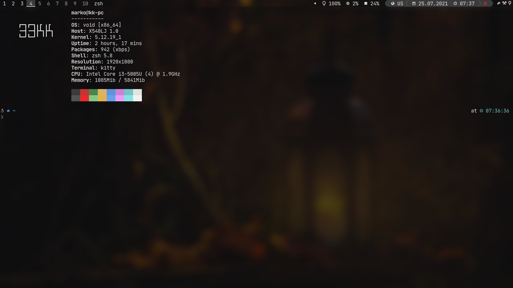
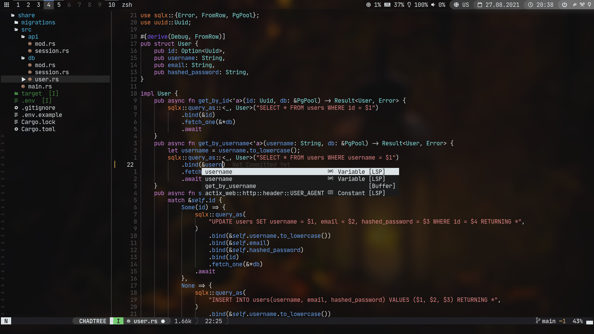
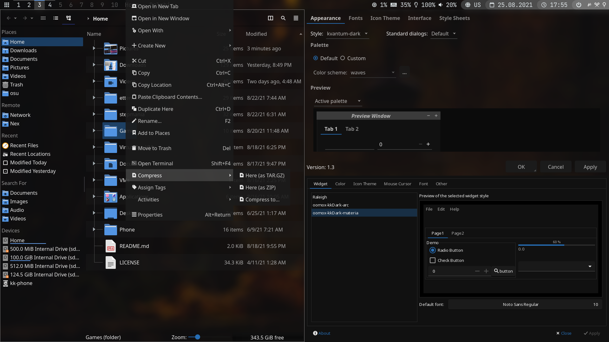
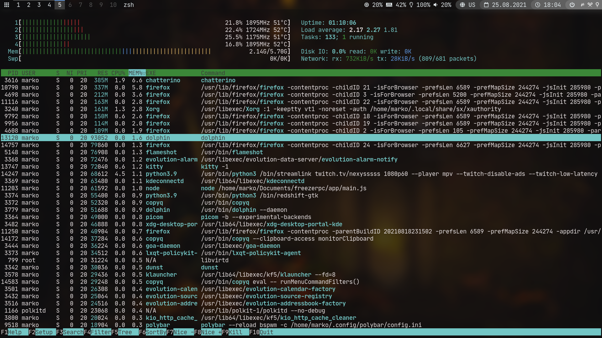
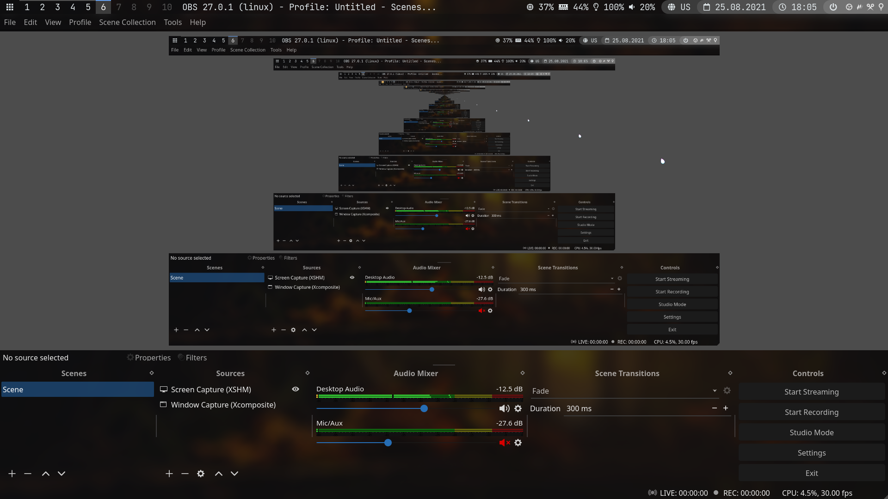
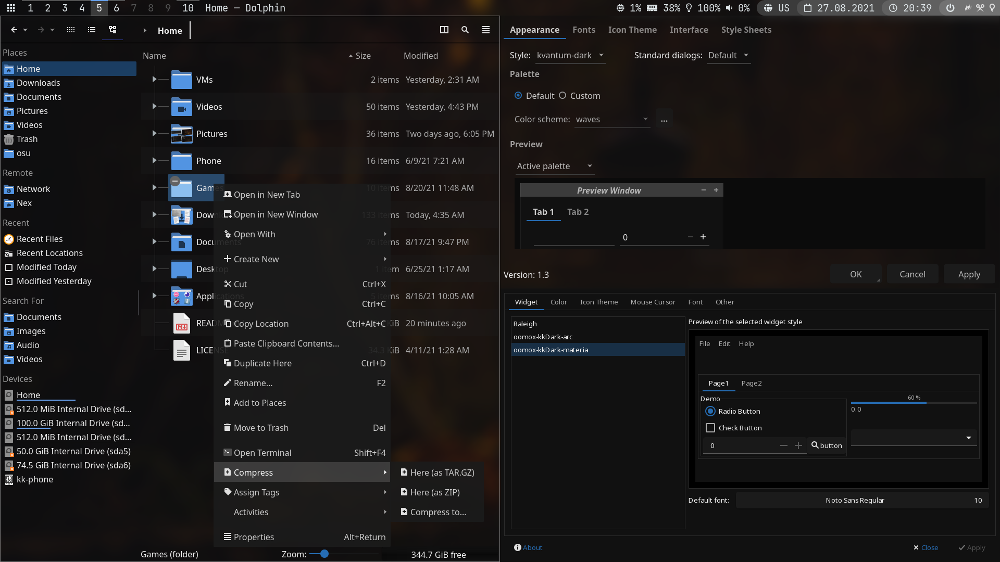
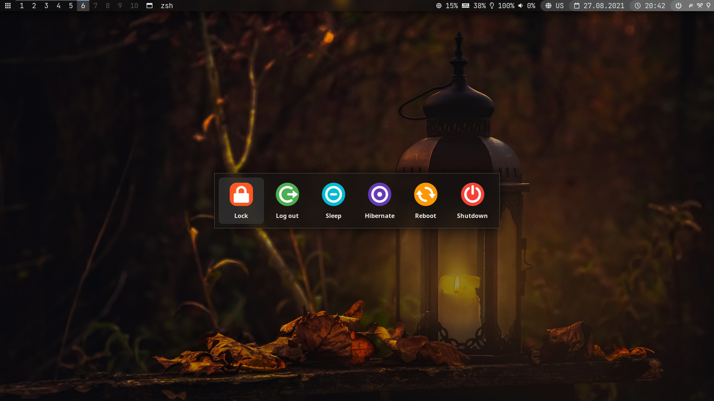
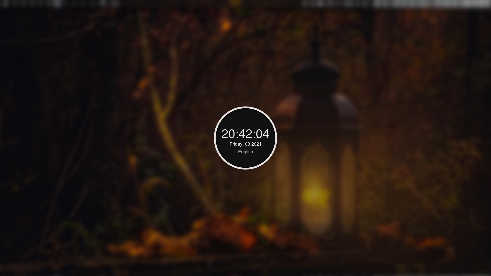

# 33KK's Dotfiles

## Screenshots











## Details

- To bootstrap system from a clean void/arch install check out [setup](#setup) section
- To set mouse sensitivity use `sens` script
- To change keyboard layouts edit `.local/bin/xorg-layouts` and add icon in `.config/polybar/modules/xkeyboard.ini`
- To persist monitor configuration put your xrandr command in `.local/bin/xorg-setup-display`
- View and edit keybindings in `.config/bspwm/sxhkdrc`
- View and edit aliases in `.config/sh/rc.d/alias`

### System

- **Distro**: void
- **Shell**: zsh
- **Sound server**: pipewire
- **Window manager**: bspwm
- **XDG autostart**: dex
- **Hotkey daemon**: sxhkd
- **Panel**: polybar
- **Compositor**: picom
- **Notifications daemon**: dunst
- **Lockscreen**: i3lock-color
- **OOM daemon**: earlyoom

#### Void-specific

- **NTP daemon**: chronyd

### Software

- **Launcher**: rofi
- **Terminal emulator**: kitty
- **Web browser**: firefox
- **File manager**: dolphin
- **Media players**: mpv, vlc
- **Image viewer**: gwenview
- **Calculator**: qalculate-gtk
- **Color picker**: kcolorchooser
- **Emoji picker**: rofi-emoji
- **Clipboard manager**: copyq
- **Android integration**: kdeconnect

#### Config

- **Volume control**: pavucontrol
- **Audio routing**: qjackctl
- **Qt5 settings**: qt5ct

#### CLI

- **Text editor**: neovim
- **System monitor**: htop
- **cat** -> bat
- **grep** -> rg
- **ls** -> exa
- **cd** -> zoxide

### Scripts

- **sens**: set mouse sensitivity
- **wp**: set wallpaper
- **xorg-layouts**: set xorg keyboard layouts
- **xorg-setup-display**: setup xorg display
- **x-\***: default graphical apps

### Themes

- **Qt**: [kkDark](.config/Kvantum/kkDark)
- **GTK**: [kkDark](.local/share/themes/oomox-kkDark-materia)
- **rofi**: [kkDark](.config/rofi/themes/kkDark)
- **obs**: [SystemDark](.config/obs-studio/themes)
- **kitty**: [kkDark](https://github.com/33kk/dotfiles/blob/master/.config/kitty/themes/kkDark.conf)
- **nvim**: [kkDark](https://github.com/33kk/kkDark)
- **Firefox**: [Edge-FrFox + kkDark colors](https://github.com/bmFtZQ/Edge-FrFox)

## Usage

### Setup

This was only tested on a clean void/arch install. Xorg, Fonts, Amd, Nvidia & Intel GPU drivers, OpenGL/Mesa/Vulkan libraries, sound server should all get automatically installed.

**Nvidia DKMS driver requires kernel headers, make sure to install those for your kernel of choice**

#### Void Linux

```bash
sudo xbps-install -S git
git clone --bare https://github.com/33kk/dotfiles ~/.dotfiles/git
git --bare --git-dir="$HOME"/.dotfiles/git --work-tree="$HOME" checkout
~/.dotfiles/scripts/setup.sh
```

#### Arch Linux

```bash
sudo pacman -Syu git
git clone --bare https://github.com/33kk/dotfiles ~/.dotfiles/git
git --bare --git-dir="$HOME"/.dotfiles/git --work-tree="$HOME" checkout
~/.dotfiles/scripts/setup.sh
```

### Update

```bash
config pull
~/.dotfiles/scripts/setup.sh
```

In case of conflics you should commit your changes and then pull. Make sure to check recent commits in case there are breaking changes.

```bash
config log # Check recent commits

config add -f [files...]
config commit -m "commit message"
config pull
```
