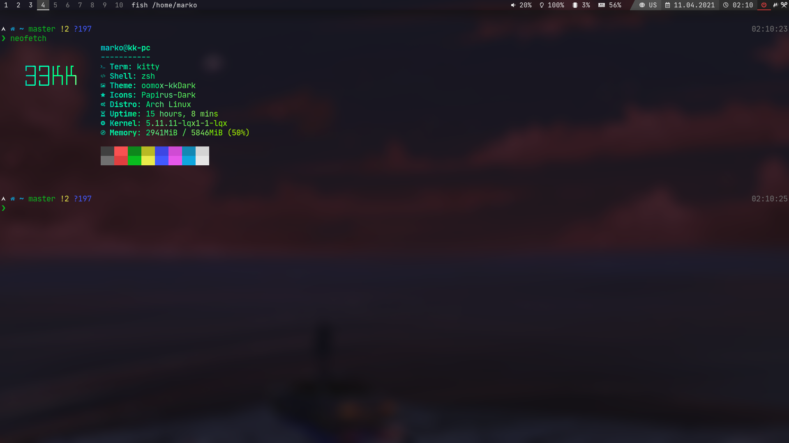
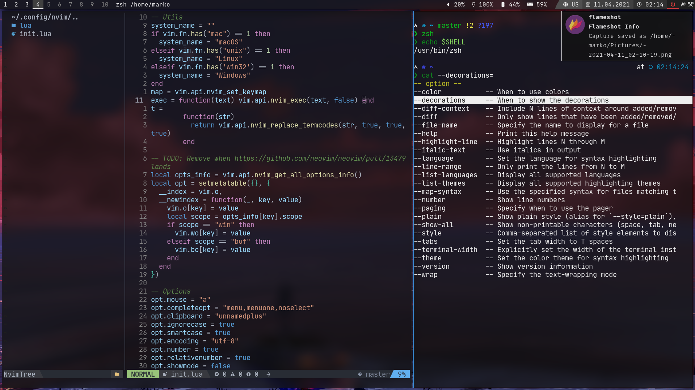
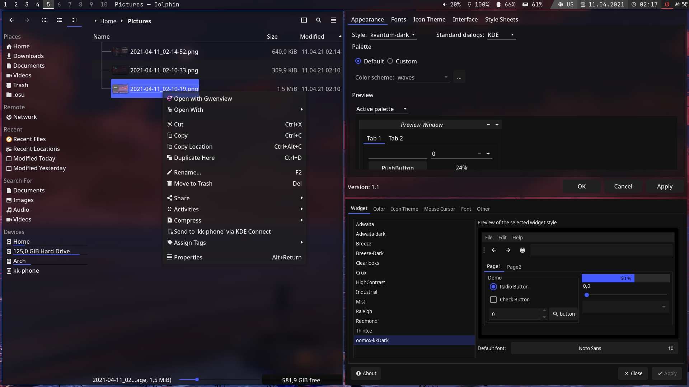

# 33KK's Dotfiles

## Contents

- bspwm
- sxhkd
- polybar
	- modular config
	- optimus-manager module
- kitty
	- codicons font
- dunst
	- use rofi for context menu
	- show icons
- fish
	- tide prompt
	- fzf integration
	- zoxide
	- sources ~/.profile
- zsh
	- zinit plugin manager
	- powerlevel10k
	- syntax highlighting
	- completions
	- suggestions
	- zoxide
	- sources ~/.profile
- qt5ct
	- use kvantum
	- Papirus-Dark icons
- gtk, oomox
	- kkDark theme
	- Papirus-Dark icons
- kvantum
	- kkDark theme
- picom
	- blur
- paru
	- nvim as file manager
- obs-studio
	- system theme with dark icons
- neofetch
- mpv
	- anime4k
- nvim
	- lua config
	- codicons for completion
	- autopairs
	- codedark colorscheme
	- lsp completion
	- galaxyline statusline
	- nvim-tree file explorer
	- startify

## Screenshots

